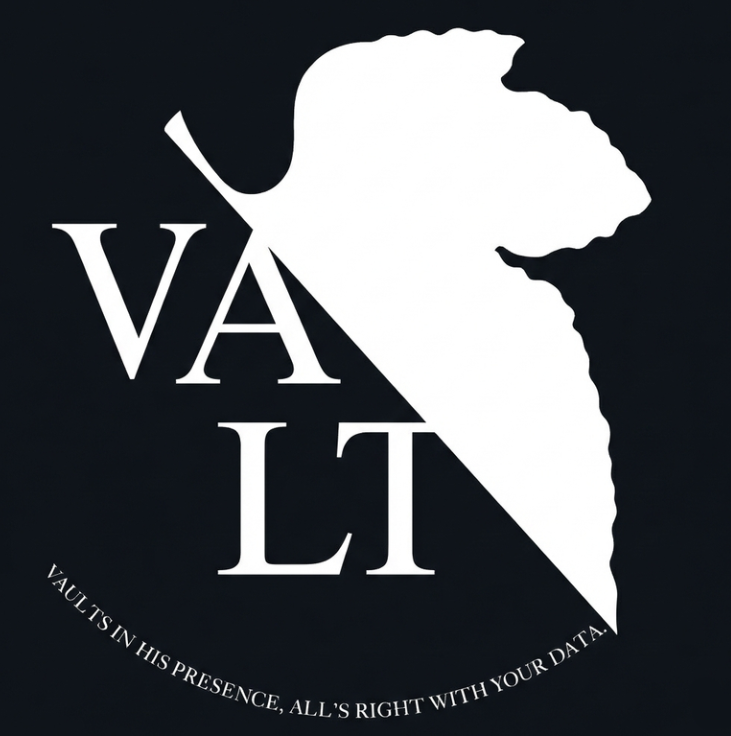

<div align="center">
  <a href="https://github.com/Omar-Alian-dev/Project-Vault">
    
  </a>
  <br />
  <br />
</div>

# 🔒 Vault - Decentralized Encrypted Storage

### **Your Data. Your Key. Forever.**


---

## 📑 Table of Contents
- [🎯 Overview](#-overview)
- [❗ Problem Statement](#-problem-statement)
- [✨ Features](#-features)
- [🛠️ Technical Stack](#-technical-stack)
- [🏗️ Architecture](#-architecture)
- [🚀 Getting Started](#-getting-started)
- [📱 Demo](#-demo)
- [🔮 Future Enhancements](#-future-enhancements)
- [👥 About the Developers](#-about-the-developers)
- [📄 License](#-license)

---

## 🎯 Overview

**Vault** is a secure, decentralized file storage application designed to bridge the gap between Web2 usability and Web3 security. Unlike traditional cloud providers (Google Drive, Dropbox), Vault operates on a **Zero-Knowledge** architecture.

It allows users to encrypt files locally in the browser and store them permanently on the **Arweave Permaweb**. The system requires **no registration** and holds **no user data**—ensuring absolute privacy and data sovereignty.

🏆 **Achievement:** Final Year Project (2026) at Azrieli College of Engineering - Software Engineering Dept.

---

## ❗ Problem Statement

In the current digital landscape, users are forced to trade privacy for convenience.
**Traditional Cloud Storage (Web2) relies on:**
* **Centralized Control:** Providers hold your encryption keys and can access your data.
* **Privacy Risks:** Data mining, censorship, and potential server breaches.
* **Rent-Seeking:** You never own your storage; you rent it monthly.

**Vault solves this by offering:**
* ✅ **Client-Side Encryption:** Files are encrypted *before* they leave your device.
* ✅ **Zero-Registration:** No emails, passwords, or personal data collection.
* ✅ **Permanent Storage:** Pay once, store forever on the Arweave Blockchain.

---

## ✨ Features

### 🔐 **Client-Side Security**
* **AES-GCM Encryption:** Military-grade encryption performed entirely in the browser using the Web Crypto API.
* **Zero-Knowledge:** The server never receives the encryption key or the unencrypted file.

### 📂 **Decentralized Storage**
* **Arweave Integration:** Data is stored on the Permaweb, ensuring it cannot be deleted or censored.
* **Bundlr Network:** Accelerated upload speeds and instant transaction finality.

### 💳 **Flexible Payments**
* **Crypto & Fiat:** Support for **Stripe** (Credit Card) and **MetaMask** (ETH/USDC) payments.
* **Pay-Per-Upload:** No monthly subscriptions.

### 🔑 **The Vault Key**
* **Unique Identity:** Users receive a generated "Vault Key" (JSON) upon upload.
* **Recovery:** This key is the *only* way to retrieve and decrypt files.

## ⚠️ Alpha Prototype
- Some features are simulated locally for architectural validation.
- Backend, Arweave, and payment integrations are planned for Beta.

---

## 🛠️ Technical Stack

| Category | Technology | Description |
| :--- | :--- | :--- |
| **Frontend** |  | UI Component Library |
| |  | Styling & Responsiveness |
| **Backend** |  | API & Payment Coordination |
| |  | Server Framework |
| **Storage** |  | Permanent Decentralized Storage |
| **Database** |  | Anonymous Metadata & Logs |
| **Payments** |  | Credit Card Processing |

---

## 🏗️ Architecture

Vault utilizes a **Client-Heavy Architecture** to ensure privacy.

**Flow:**
1.  **Browser:** Generates Key -> Encrypts File -> Sends Payment Request.
2.  **Server:** Verifies Payment -> Signs Upload Transaction.
3.  **Browser:** Uploads Encrypted Data directly to Arweave (bypassing the server for data transfer).


---

## 🚀 Getting Started

### Prerequisites
* Node.js (v16 or higher)
* MongoDB Instance (Local or Atlas)
* Arweave Wallet Keyfile (for Bundlr node funding)
* Stripe Account (Test Mode)

### Installation

1.  **Clone the repository**
    ```bash
    git clone [https://github.com/Omar-Alian-dev/Project-Vault.git](https://github.com/Omar-Alian-dev/Project-Vault.git)
    cd Project-Vault
    ```

2.  **Install Dependencies (Root, Client, Server)**
    ```bash
    # Install root dependencies
    npm install

    # Install Client dependencies
    cd client && npm install

    # Install Server dependencies
    cd ../server && npm install
    ```

3.  **Environment Configuration**
    Create a `.env` file in the `server` directory:
    ```env
    PORT=5000
    MONGO_URI=your_mongodb_connection_string
    STRIPE_SECRET_KEY=your_stripe_secret_key
    ARWEAVE_KEY=your_arweave_wallet_key
    ```

4.  **Run the Application**
    ```bash
    # Run both Client and Server concurrently
    npm run dev
    ```

---

## 📱 Demo

### 🎥 Live Demo
*(Coming Soon: Video demonstration showcasing the key features)*

### 📸 Key Features Preview

| Feature | Screenshot | Description |
| :--- | :--- | :--- |
| **Upload** | [Upoad Screen] | Drag & Drop interface with file validation |
| **Encryption** | [Encryption Screen] | Real-time progress bar for client-side encryption |
| **Vault Key** | [Vault Screen] | Success screen showing the generated key |
| **Retrieval** | [Retrieval Screen] | Input field to paste key and decrypt files |

---

## 🔮 Future Enhancements

* 📱 **Mobile Optimization:** Full responsive support for mobile browsers.
* 📄 **Recovery PDF:** Auto-generate a PDF containing the Vault Key and QR code.
* 🤝 **P2P Sharing:** Secure file sharing mechanism using public-key cryptography.
* 📊 **Admin Dashboard:** Analytics for system health and transaction volume.

---

## 👥 About the Developers

**Omar Alian**
*Full Stack Engineer | Blockchain Enthusiast*

**Anas Kadamany**
*Software Engineer | Backend Specialist*

🎓 **Education:** B.Sc in Software Engineering, Azrieli College of Engineering.
💻 **Specialization:** Web3, React, Node.js, Cryptography.

### 📫 Connect With Us

<a href="https://github.com/Omar-Alian-dev">
  
</a>
<a href="https://www.linkedin.com/in/omar-alian/">
  
</a>

<br />

<a href="https://github.com/AnasKadamany">
  
</a>
<a href="https://www.linkedin.com/in/anas-kadamany/">
  
</a>

---

## 🤝 Contributing

This is a private academic project. Contributions are not accepted from external developers at this time.

### 📧 Contact

For inquiries regarding this project, please contact:

* **Developer:** Omar Alian
    * Email: [3mr3lian1234@gmail.com](3mr3lian1234@gmail.com)
* **Developer:** Anas Kadamany
    * Email: [anaskadamany@hotmail.com](anaskadamany@hotmail.com)

### 🐛 Bug Reports

If you have found a bug, please contact the developers directly with:

* Clear description of the problem
* Steps to reproduce
* Expected vs actual behavior
* Screenshots (if applicable)

---

## 📄 License
**Proprietary License**
Copyright (c) 2026 Omar Alian & Anas Kadamany. All rights reserved.

Made with ❤️ by Omar & Anas
